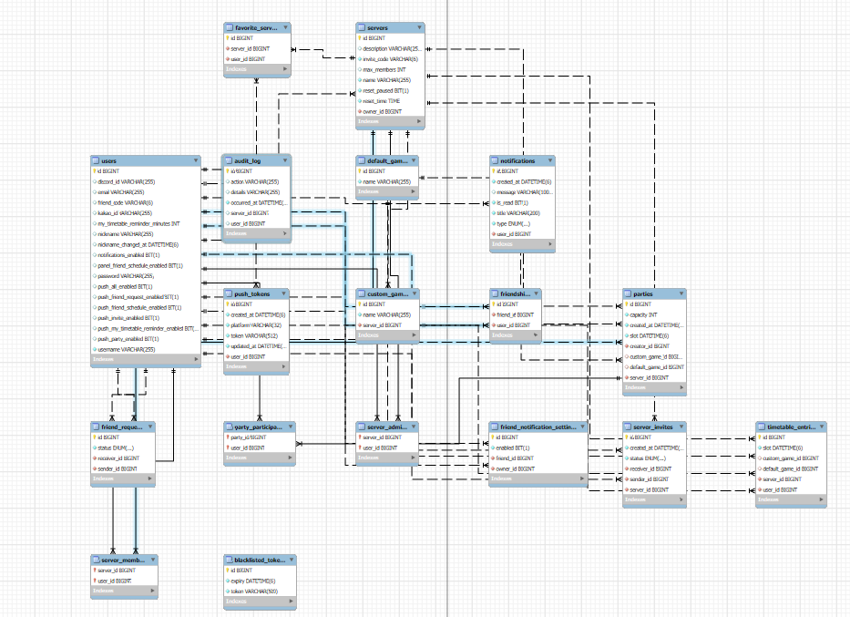

# GameSync Backend

GameSync는 팀/친구와 게임 약속을 쉽고 정확하게 잡는 서비스입니다. 이 레포는 Spring Boot 기반 백엔드로, OAuth2 로그인(Discord/Kakao), JWT 인증, 서버/파티/시간표 도메인, 푸시(Firebase FCM/APNs), 스케줄러, 감사 로그까지 운영에 필요한 기능을 제공합니다.

---

## TL;DR (포트폴리오 하이라이트)
- 인증/보안: JWT 24h 만료, 로그아웃 시 블랙리스트, OAuth2(Discord/Kakao)
- 도메인: 서버/멤버/관리자, 초대코드, 커스텀 게임, 타임테이블
- 통계 API: 최다 게임, 평균 슬롯, 피크 시간
- 스케줄러: 분 단위 초기화, 매일 03:00 블랙리스트 정리, 알림 리마인더 설계
- 푸시: 사용자 보유 토큰(FCM/APNs) 팬아웃, 카테고리별 알림
- 운영: CORS, 무상태 아키텍처, 오류 표준화, AWS EC2+RDS 배포

---

## 기술 스택
- Java 17, Spring Boot 3.5.x
- Spring Security, Spring OAuth2 Client
- Spring Data JPA (Hibernate) + MySQL(RDS), H2(Test)
- JJWT, Firebase Admin SDK(FCM)
- Gradle, AWS EC2/ALB/RDS, CloudWatch

---

## 주요 기능
- JWT 기반 인증, 토큰 블랙리스트(로그아웃/탈취 대응)
- OAuth2 로그인(Discord/Kakao) → 토큰/사용자 정보 프론트 전달
- 서버(Server) 생성/검색/참여/초대코드, 관리자 위임/회수, 강퇴, 삭제/탈퇴
- 타임테이블 예약/조회/통계(최다 게임·평균·피크)
- 커스텀 게임 추가/삭제 및 해당 게임 예약 사용자 목록
- 분단위 초기화 스케줄러, 매일 03:00 블랙리스트 정리
- 감사 로그(Audit): 생성/참가/탈퇴/권한변경 기록

---

## 아키텍처 & 디렉토리

### 배포 아키텍처 개요

.png)

EC2 + ALB + RDS(MySQL) 기반으로 서비스하며, CloudWatch로 로그/지표를 수집합니다. ALB 헬스체크를 통해 무중단 배포/롤백 기준을 운영합니다.
```
src
└─ main
   ├─ java/com/example/scheduler
   │   ├─ config        # 초기화, 부트스트랩
   │   ├─ controller    # REST API
   │   ├─ dto           # Request/Response
   │   ├─ domain        # JPA 엔터티(User/Server/Timetable/...)
   │   ├─ repository    # Spring Data JPA
   │   ├─ scheduler     # 리셋/블랙리스트 정리 스케줄러
   │   ├─ security      # JWT 필터, OAuth2 Success 핸들러
   │   └─ service       # 비즈니스 로직, 권한 검사, 통계
   └─ resources
       └─ application.properties, default_games.txt
```

---

## 설정 예시 (application.properties)
```properties
server.port=8080

# DB
spring.datasource.url=jdbc:mysql://<HOST>:3306/scheduler_db?serverTimezone=Asia/Seoul&useSSL=false
spring.datasource.username=<USER>
spring.datasource.password=<PASS>

# JPA
spring.jpa.hibernate.ddl-auto=update
spring.jpa.properties.hibernate.dialect=org.hibernate.dialect.MySQL8Dialect

# JWT (24h)
jwt.secret=<BASE64_SECRET>
jwt.expiration-ms=86400000

# OAuth2 (Discord/Kakao)
spring.security.oauth2.client.registration.discord.client-id=<CLIENT_ID>
spring.security.oauth2.client.registration.discord.client-secret=<CLIENT_SECRET>
spring.security.oauth2.client.registration.discord.redirect-uri={baseUrl}/login/oauth2/code/{registrationId}
spring.security.oauth2.client.registration.discord.scope=identify,email
spring.security.oauth2.client.provider.discord.authorization-uri=https://discord.com/api/oauth2/authorize
spring.security.oauth2.client.provider.discord.token-uri=https://discord.com/api/oauth2/token
spring.security.oauth2.client.provider.discord.user-info-uri=https://discord.com/api/users/@me
spring.security.oauth2.client.provider.discord.user-name-attribute=id

spring.security.oauth2.client.registration.kakao.client-id=<CLIENT_ID>
spring.security.oauth2.client.registration.kakao.client-secret=<CLIENT_SECRET>
spring.security.oauth2.client.registration.kakao.redirect-uri={baseUrl}/login/oauth2/code/{registrationId}
spring.security.oauth2.client.registration.kakao.authorization-grant-type=authorization_code
spring.security.oauth2.client.registration.kakao.scope=profile_nickname,account_email
spring.security.oauth2.client.provider.kakao.authorization-uri=https://kauth.kakao.com/oauth/authorize
spring.security.oauth2.client.provider.kakao.token-uri=https://kauth.kakao.com/oauth/token
spring.security.oauth2.client.provider.kakao.user-info-uri=https://kapi.kakao.com/v2/user/me
spring.security.oauth2.client.provider.kakao.user-name-attribute=id

# Front/Back base URL & callbacks
app.frontend.base-url=https://<frontend-host>
app.frontend.discord-callback-path=/auth/discord/callback
app.frontend.kakao-callback-path=/auth/kakao/callback
app.backend.base-url=https://<backend-host>

# CORS
app.cors.allowed-origins=https://<frontend-host>,http://localhost:3000

# Firebase Admin (환경 변수 권장)
# GOOGLE_APPLICATION_CREDENTIALS=/abs/path/service-account.json
```

---

## 인증/보안 개요
- 폼 로그인 및 OAuth2(Discord/Kakao) 지원 → `OAuth2LoginSuccessHandler`에서 JWT 발급 후 프론트 콜백으로 리다이렉트
- `JwtAuthenticationFilter`에서 서명/만료/블랙리스트 검사 후 SecurityContext 구성
- 만료 24시간(`jwt.expiration-ms=86400000`), 로그아웃 시 `BlacklistedToken` 테이블에 만료 시각과 함께 저장
- CORS 허용 도메인 제한, STATELESS 세션, 최소 권한(Role: USER)

---

## 스케줄러
- 매분: 각 `Server.resetTime`과 현재 시각이 일치 시 해당 서버 타임테이블 엔트리 초기화
- 매일 03:00: 만료된 블랙리스트 토큰 정리
- (설계) 합류 N분 전 푸시 리마인더 트리거

---

## API 요약(발췌)
- 인증
  - `POST /api/auth/signup` – 회원가입
  - `POST /api/auth/login` – 로그인 → `{ token, userId, nickname }`
  - `POST /api/auth/logout` – 로그아웃(토큰 블랙리스트 등록)
- 서버
  - `GET /api/servers` – 서버 목록, `GET /api/servers/{id}` – 상세
  - `POST /api/servers` – 생성, `POST /api/servers/{id}/join` – 참가
  - `PUT /api/servers/{id}/name` – 이름 변경, `PUT /api/servers/{id}/reset-time` – 초기화 시간 변경
  - `POST /api/servers/{id}/admins` – 관리자 임명/해제, `POST /api/servers/{id}/kick` – 강퇴
  - `DELETE /api/servers/{id}` – 삭제, `POST /api/servers/{id}/leave` – 떠나기
- 게임/타임테이블
  - `GET /api/games/default` – 기본 게임 목록
  - `GET /api/servers/{id}/custom-games` – 커스텀 게임 목록, `POST /api/servers/{id}/custom-games` – 추가
  - `DELETE /api/servers/{id}/custom-games/{gameId}` – 삭제(연관 엔트리 정리)
  - `GET /api/servers/{id}/timetable` – 예약 목록(필터/정렬), `POST /api/servers/{id}/timetable` – 예약 등록
  - `GET /api/servers/{id}/timetable/stats` – 최다 게임/평균/피크

> 상세 스펙은 `controller/`와 `dto/` 참조.

---

## 데이터 모델(요약)

- `User(id, username, nickname, password?, discordId?, email?)`
- `Server(id, name, owner, members[], admins[], inviteCode, resetTime)`
- `TimetableEntry(id, server, user, slot, defaultGame?, customGame?)`
- `DefaultGame(id, name)` / `CustomGame(id, name, server)`
- `AuditLog(id, serverId, userId, action, occurredAt, details)`
- `BlacklistedToken(id, token, expiry)`

---

## 빌드 & 실행
```bash
./gradlew clean build
java -jar build/libs/gamesync-backend-0.0.1-SNAPSHOT.jar

# 개발 모드
./gradlew bootRun
```

Windows:
```bat
gradlew.bat clean build
java -jar build\libs\gamesync-backend-0.0.1-SNAPSHOT.jar
gradlew.bat bootRun
```

---

## 운영/배포 노트
- AWS EC2 + ALB + RDS, 헬스체크 엔드포인트 `/healthcheck`
- CloudWatch 로그 수집, 롤백 기준 정의(헬스체크 실패/에러율)
- 시크릿/키: SSM 또는 환경변수 주입, JWT 키는 Base64로 관리

---

## 테스트
```bash
./gradlew test
```
- H2 기반 통합 테스트, Spring Security Test

---

## Authors
- Lead: 전체 아키텍처/보안, 인증·스케줄러·핵심 API 설계 및 구현
- Team: Game/Timetable 서비스 구현, 예외 처리/문서 보강
